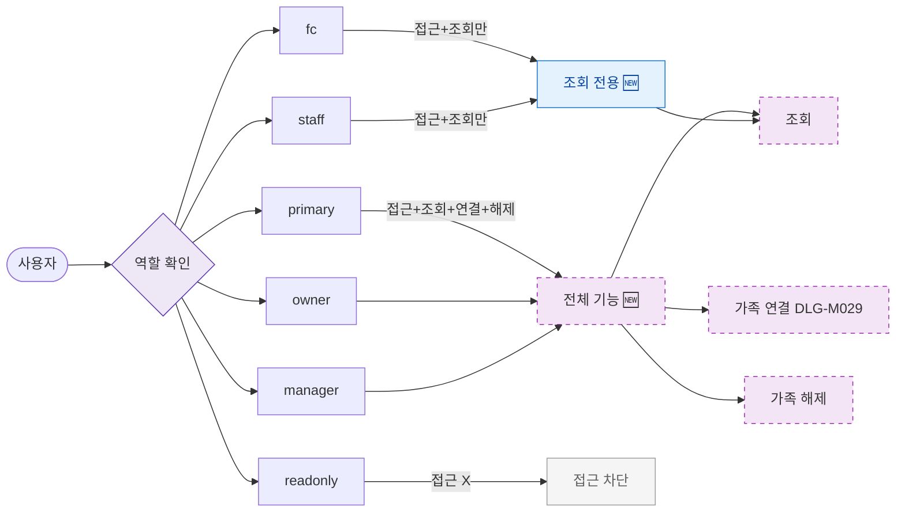

## 1. 목적

SCR-M008에서 역할별 접근 및 액션 범위를 명세한다. 🆕 미구현 기능.

## 2. 트리거/전제조건

- 사용자 로그인 상태

## 3. 다이어그램

## 4. 엣지 설명

| 출발 | 도착 | 조건 |
|------|------|------|
| primary | 전체 기능 | 허용 |
| owner | 전체 기능 | 허용 |
| manager | 전체 기능 | 허용 |
| fc | 조회 전용 | 연결/해제 불가 |
| staff | 조회 전용 | 연결/해제 불가 |
| readonly | 접근 차단 | 접근 불가 |
