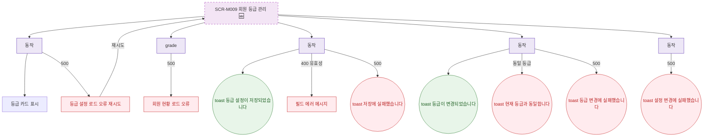

## 1. 목적

SCR-M009의 에러 코드별 분기와 복구 경로를 명세한다. 🆕 미구현 기능.

## 2. 트리거/전제조건

- SCR-M009 API 호출 실패 시

## 3. 다이어그램

## 4. 엣지 설명

| 출발 | 도착 | 조건 |
|------|------|------|
| 설정 API | 에러 + 재시도 | 500 |
| 수정 API | 필드 에러 | 400 유효성 |
| 수정 API | toast | 500 |
| 등급 변경 API | toast | 동일 등급 |
| 등급 변경 API | toast | 500 |
