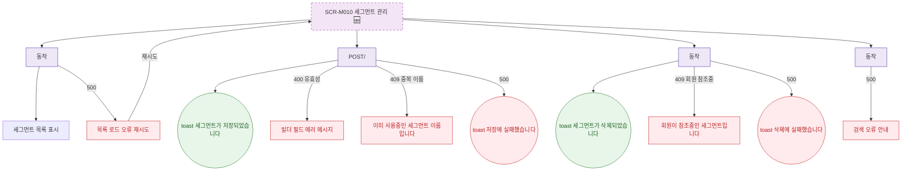

## 1. 목적

SCR-M010의 에러 코드별 분기와 복구 경로를 명세한다. 🆕 미구현 기능.

## 2. 트리거/전제조건

- SCR-M010 API 호출 실패 시

## 3. 다이어그램

## 4. 엣지 설명

| 출발 | 도착 | 조건 |
|------|------|------|
| 목록 API | 오류+재시도 | 500 |
| 저장 API | 필드 에러 | 400 유효성 |
| 저장 API | 중복 이름 에러 | 409 |
| 저장 API | toast | 500 |
| 삭제 API | 참조 오류 | 409 |
| 삭제 API | toast | 500 |
