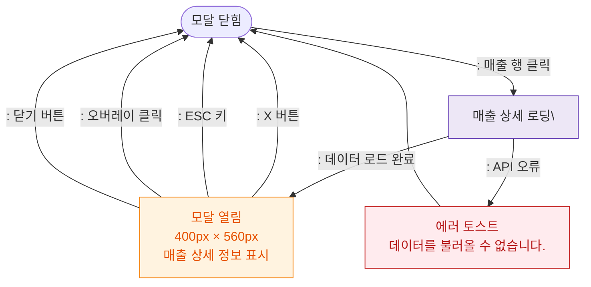

## 1. 목적
DLG-S001 매출상세 모달의 열기/닫기/파기 생명주기를 표현한다.

## 2. 전제조건
- SCR-S001 매출현황 화면에서 행 클릭

## 3. 다이어그램

## 4. 엣지 설명

| 출발 | 도착 | 설명 |
|------|------|------|
| CLOSED | LOADING | 매출 행 클릭 → 데이터 로드 |
| LOADING | OPEN | 로드 성공 → 모달 표시 |
| LOADING | ERR_TOAST | 로드 실패 → 에러 토스트 |
| OPEN | CLOSED | X 버튼 닫기 |
| OPEN | CLOSED | ESC 키 닫기 |
| OPEN | CLOSED | 오버레이 클릭 닫기 |
