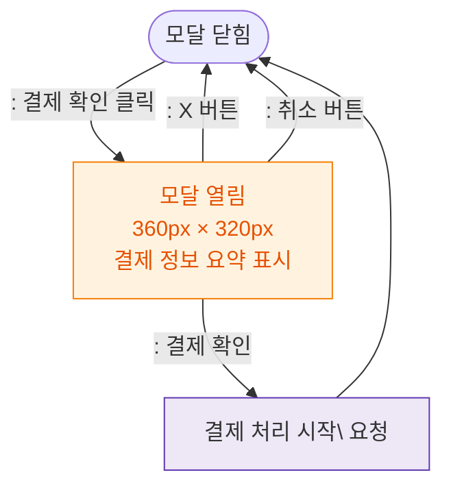

## 1. 목적
DLG-S003 결제확인 모달의 열기/닫기 생명주기를 표현한다.

## 2. 전제조건
- SCR-S003 결제처리 화면에서 결제 확인 버튼 클릭

## 3. 다이어그램

## 4. 엣지 설명

| 출발 | 도착 | 설명 |
|------|------|------|
| CLOSED | OPEN | 결제 확인 버튼 클릭 |
| OPEN | PROCESS | 결제 확인 → PG 요청 |
| OPEN | CLOSED | X 버튼 닫기 |
| OPEN | CLOSED | 취소 버튼 닫기 |
