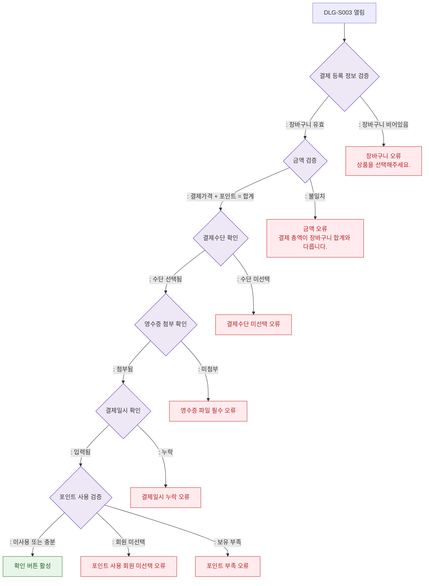

## 1. 목적
DLG-S003 결제확인 모달에서 현장 결제 등록 정보 유효성 검증 흐름을 표현한다.

## 2. 전제조건
- DLG-S003 열림 상태

## 3. 다이어그램

## 4. 엣지 설명

| 출발 | 도착 | 설명 |
|------|------|------|
| VALIDATE | AMOUNT_CHECK | 장바구니 유효 |
| VALIDATE | ERR_CART | 장바구니 빈 상태 |
| AMOUNT_CHECK | METHOD_CHECK | 결제가격 + 포인트 사용액이 장바구니 합계와 일치 |
| AMOUNT_CHECK | ERR_AMOUNT | 결제 총액 불일치 |
| METHOD_CHECK | RECEIPT_CHECK | 결제수단 선택됨 |
| RECEIPT_CHECK | PAID_AT_CHECK | 영수증 첨부됨 |
| PAID_AT_CHECK | POINT_CHECK | 결제일시 입력됨 |
| POINT_CHECK | CONFIRM_READY | 포인트 검증 통과 |
