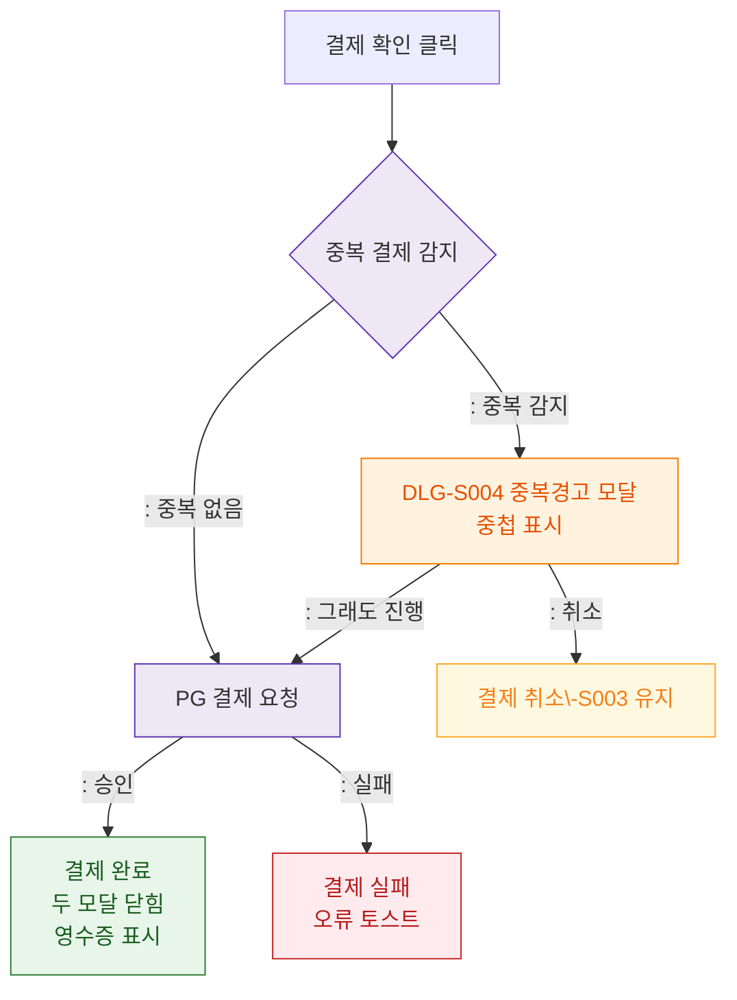

## 1. 목적
DLG-S003 결제 확인 후 결과 분기 - 중복 결제 감지 시 DLG-S004 중첩을 표현한다.

## 2. 전제조건
- DLG-S003에서 확인 버튼 클릭

## 3. 다이어그램

## 4. 엣지 설명

| 출발 | 도착 | 설명 |
|------|------|------|
| CONFIRM | DUP_CHECK | 중복 결제 사전 검사 |
| DUP_CHECK | PG_REQUEST | 중복 없음 → 즉시 진행 |
| DUP_CHECK | DLG_S004 | 중복 감지 → 경고 모달 |
| DLG_S004 | PG_REQUEST | 경고 무시 후 진행 |
| PG_REQUEST | SUCCESS | PG 승인 → 완료 |
| PG_REQUEST | FAIL | PG 실패 |
