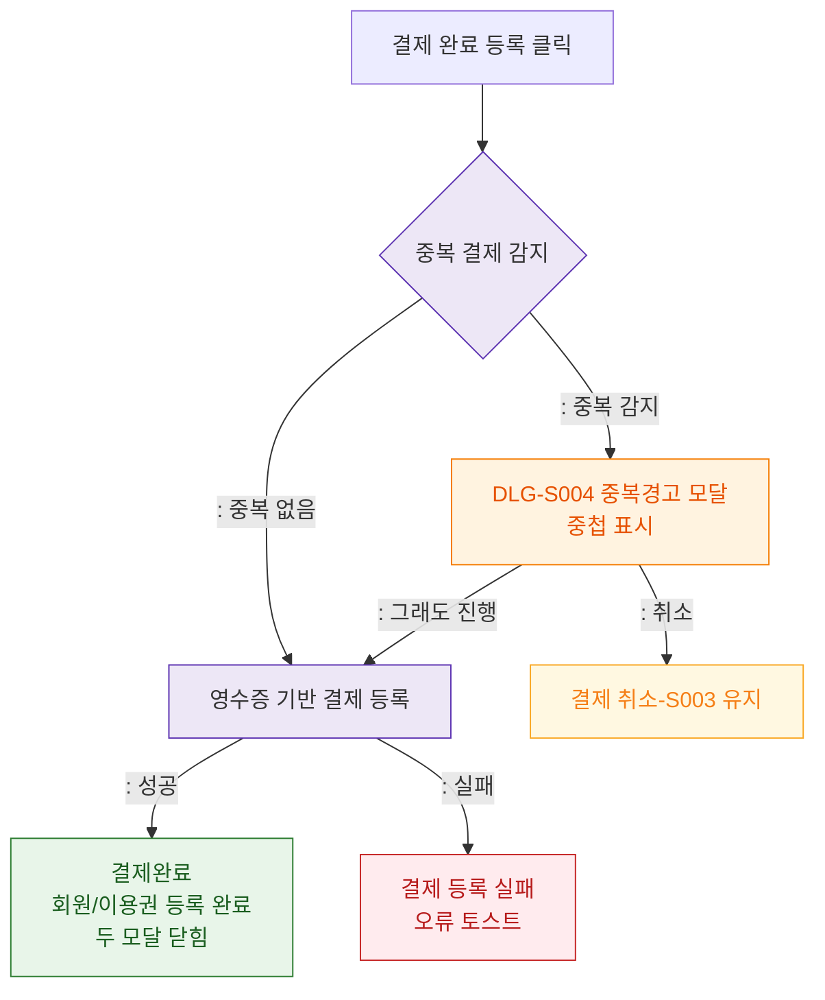

## 1. 목적
DLG-S003 결제 완료 등록 후 결과 분기 - 중복 결제 감지 시 DLG-S004 중첩을 표현한다.

## 2. 전제조건
- DLG-S003에서 결제 완료 등록 버튼 클릭

## 3. 다이어그램

```mermaid
flowchart TD
    CONFIRM[결제 완료 등록 클릭] --> DUP_CHECK{중복 결제 감지}

    DUP_CHECK -->|": 중복 없음"|REGISTER[영수증 기반 결제 등록]
    DUP_CHECK -->|": 중복 감지"|DLG_S004[DLG-S004 중복경고 모달\n중첩 표시]

    DLG_S004 -->|": 그래도 진행"|REGISTER
    DLG_S004 -->|": 취소"|CANCEL[결제 취소-S003 유지]

    REGISTER -->|": 성공"|SUCCESS[결제완료\n회원/이용권 등록 완료\n두 모달 닫힘]
    REGISTER -->|": 실패"|FAIL[결제 등록 실패\n오류 토스트]

    classDef modal fill:#FFF3E0,stroke:#F57C00,color:#E65100
    classDef system fill:#EDE7F6,stroke:#5E35B2
    classDef success fill:#E8F5E9,stroke:#2E7D32,color:#1B5E20
    classDef error fill:#FFEBEE,stroke:#C62828,color:#B71C1C
    classDef warning fill:#FFF8E1,stroke:#F9A825,color:#F57F17

    class DLG_S004 modal
    class DUP_CHECK,REGISTER system
    class SUCCESS success
    class FAIL error
    class CANCEL warning
```

## 4. 엣지 설명

| 출발 | 도착 | 설명 |
|------|------|------|
| CONFIRM | DUP_CHECK | 중복 결제 사전 검사 |
| DUP_CHECK | REGISTER | 중복 없음 → 영수증 기반 결제 등록 |
| DUP_CHECK | DLG_S004 | 중복 감지 → 경고 모달 |
| DLG_S004 | REGISTER | 경고 무시 후 등록 |
| REGISTER | SUCCESS | 결제완료 + 회원/이용권 등록 완료 |
| REGISTER | FAIL | 결제 등록 실패 |
