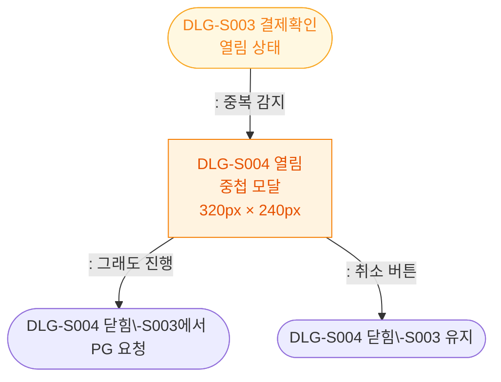

## 1. 목적
DLG-S004 중복결제경고 모달의 열기/닫기 생명주기를 표현한다. DLG-S003 위에 중첩 표시된다.

## 2. 전제조건
- DLG-S003에서 중복 결제 감지됨

## 3. 다이어그램

## 4. 엣지 설명

| 출발 | 도착 | 설명 |
|------|------|------|
| DLG_S003 | OPEN | 중복 감지 → 경고 모달 |
| OPEN | CLOSED_PROCEED | 진행 확인 → DLG 닫힘 |
| OPEN | CLOSED_CANCEL | 취소 → DLG-S003 유지 |
