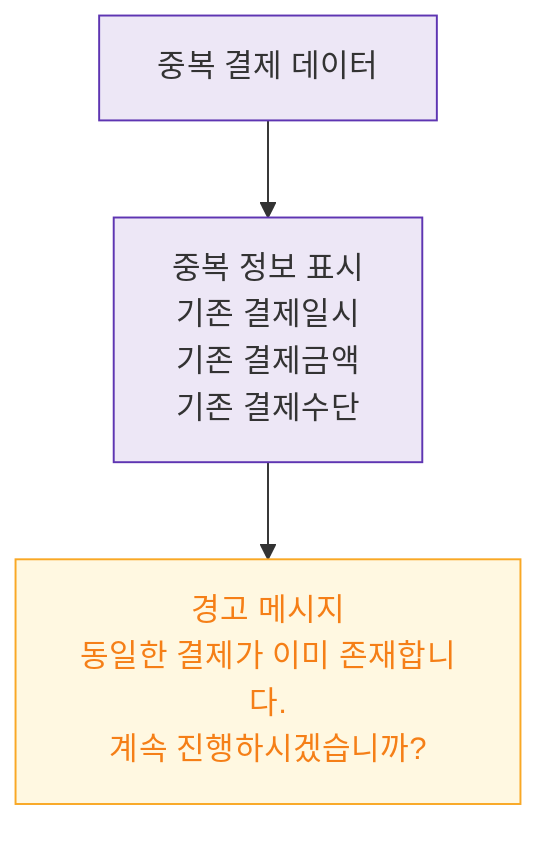

## 1. 목적
DLG-S004는 경고 확인 전용 모달로 입력 필드 없음. 중복 정보 표시 규칙을 표현한다.

## 2. 전제조건
- DLG-S004 열림 상태

## 3. 다이어그램

## 4. 엣지 설명

| 출발 | 도착 | 설명 |
|------|------|------|
| DUP_DATA | DISPLAY | 중복 결제 정보 렌더링 |
| DISPLAY | WARN_MSG | 경고 메시지 표시 |
