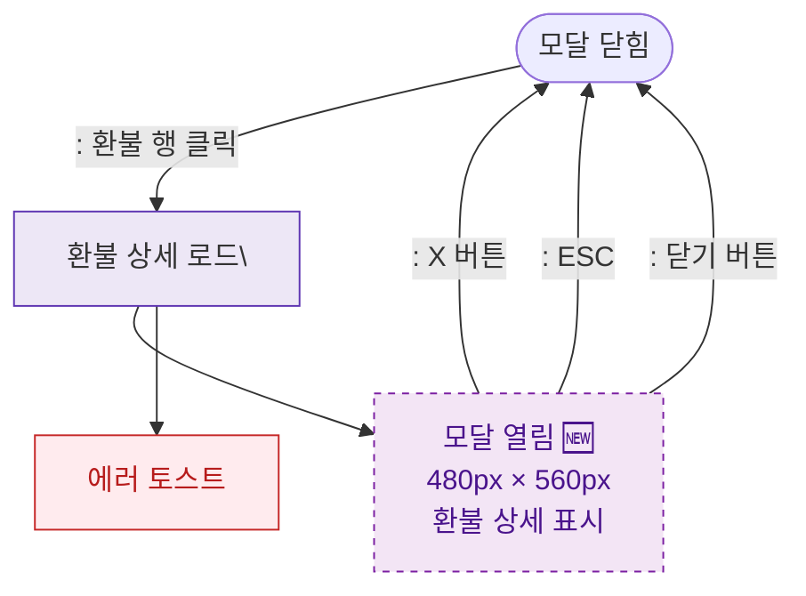

## 1. 목적
DLG-S006 환불상세 모달(🆕)의 열기/닫기 생명주기를 표현한다.

## 2. 전제조건
- SCR-S007 환불관리에서 환불 행 클릭

## 3. 다이어그램

## 4. 엣지 설명

| 출발 | 도착 | 설명 |
|------|------|------|
| CLOSED | LOAD | 환불 행 클릭 → 로드 |
| LOAD | OPEN | 로드 성공 → 모달 |
| LOAD | ERR_TOAST | 로드 실패 |
| OPEN | CLOSED | X 버튼 닫기 |
