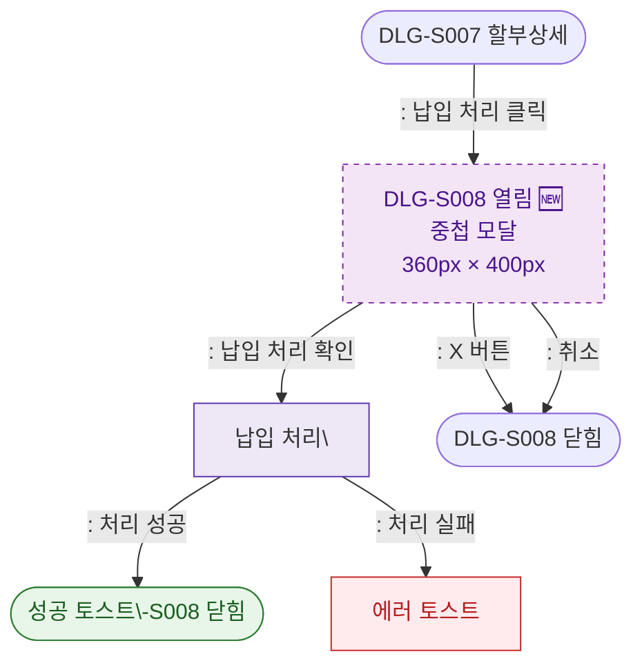

## 1. 목적
DLG-S008 납입처리 모달(🆕)의 열기/닫기 생명주기를 표현한다. DLG-S007 위에 중첩 표시된다.

## 2. 전제조건
- DLG-S007에서 납입 처리 버튼 클릭

## 3. 다이어그램

## 4. 엣지 설명

| 출발 | 도착 | 설명 |
|------|------|------|
| DLG_S007 | OPEN | 납입 처리 버튼 클릭 |
| OPEN | PROCESS | 납입 확인 → API 호출 |
| PROCESS | SUCCESS_CLOSE | 처리 성공 → 닫힘 |
| PROCESS | ERR_TOAST | 처리 실패 |
