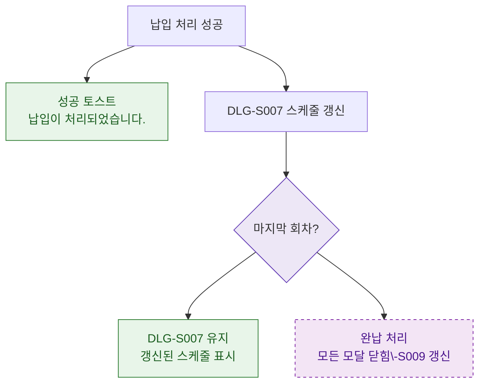

## 1. 목적
DLG-S008 납입 처리 후 결과 분기 및 DLG-S007 스케줄 갱신 흐름을 표현한다.

## 2. 전제조건
- DLG-S008에서 납입 처리 완료

## 3. 다이어그램

## 4. 엣지 설명

| 출발 | 도착 | 설명 |
|------|------|------|
| PAY_OK | SUCCESS_TOAST | 납입 성공 토스트 |
| PAY_OK | DLG_S007_REFRESH | DLG-S007 스케줄 갱신 |
| LAST | COMPLETE | 마지막 회차 → 완납 |
