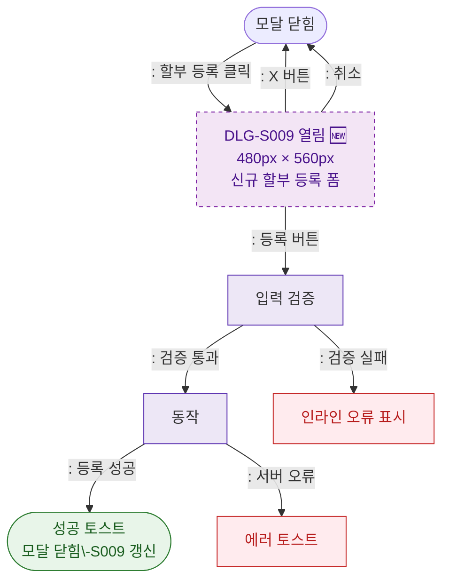

## 1. 목적
DLG-S009 할부등록 모달(🆕)의 열기/닫기 생명주기를 표현한다.

## 2. 전제조건
- SCR-S009 할부결제관리에서 할부 등록 버튼 클릭

## 3. 다이어그램

## 4. 엣지 설명

| 출발 | 도착 | 설명 |
|------|------|------|
| CLOSED | OPEN | 할부 등록 버튼 클릭 |
| OPEN | VALIDATE | 등록 버튼 → 검증 |
| VALIDATE | SAVE | 검증 통과 → API |
| SAVE | SUCCESS | 등록 성공 |
