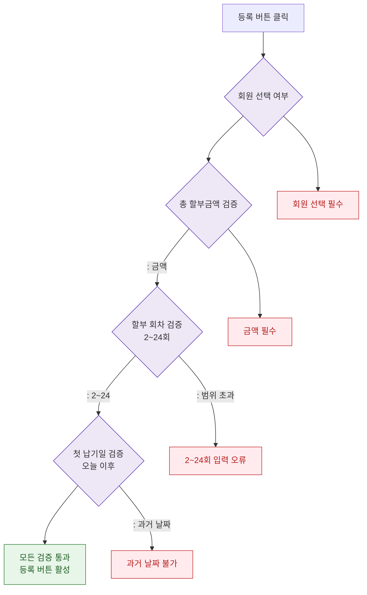

## 1. 목적
DLG-S009 할부 등록 폼의 필드별 검증 규칙을 표현한다.

## 2. 전제조건
- DLG-S009 열림 상태

## 3. 다이어그램

## 4. 엣지 설명

| 출발 | 도착 | 설명 |
|------|------|------|
| MEMBER_CHECK | ERR_MEMBER | 회원 미선택 |
| AMOUNT_CHECK | ERR_AMOUNT | 금액 0 |
| INSTALLMENT_CHECK | ERR_COUNT | 2~24회 범위 초과 |
| DATE_CHECK | ERR_DATE | 과거 날짜 |
