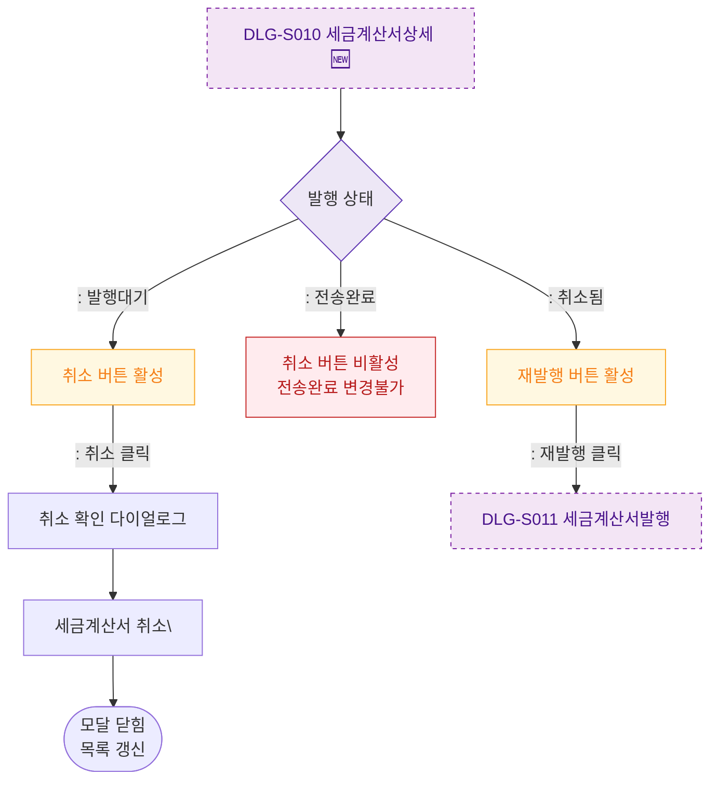

## 1. 목적
DLG-S010에서 취소/재발행 액션 분기를 표현한다.

## 2. 전제조건
- DLG-S010 열림 상태

## 3. 다이어그램

## 4. 엣지 설명

| 출발 | 도착 | 설명 |
|------|------|------|
| STATUS_CHECK | CANCEL_BTN | 발행대기 → 취소 가능 |
| STATUS_CHECK | SENT_READONLY | 전송완료 → 취소 불가 |
| STATUS_CHECK | REISSUE_BTN | 취소됨 → 재발행 가능 |
| REISSUE_BTN | DLG_S011 | 재발행 → DLG-S011 |
