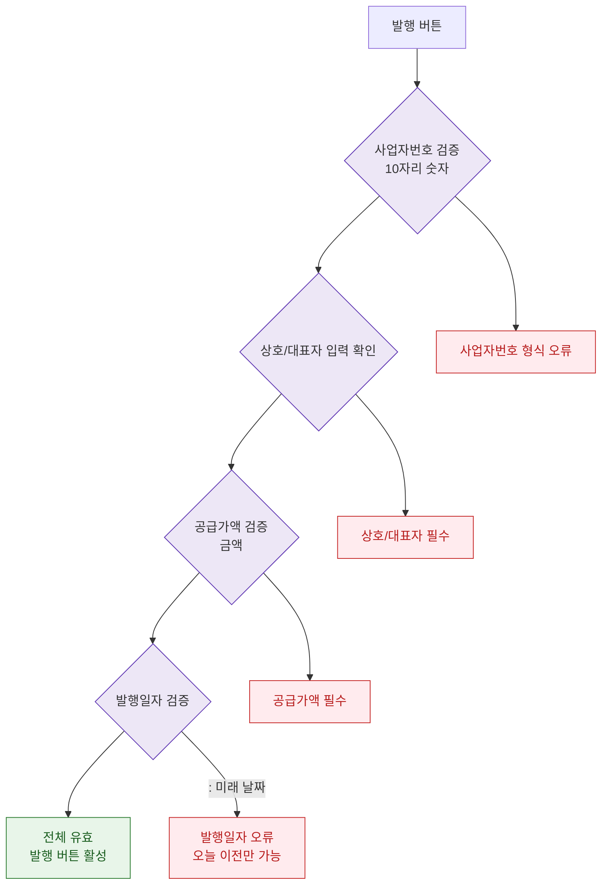

## 1. 목적
DLG-S011 세금계산서 발행 폼의 필드별 검증 규칙을 표현한다.

## 2. 전제조건
- DLG-S011 열림 상태

## 3. 다이어그램

## 4. 엣지 설명

| 출발 | 도착 | 설명 |
|------|------|------|
| BIZ_CHECK | ERR_BIZ | 사업자번호 형식 오류 |
| CORP_CHECK | ERR_CORP | 상호/대표자 미입력 |
| AMOUNT_CHECK | ERR_AMOUNT | 공급가액 0 |
| DATE_CHECK | ERR_DATE | 미래 날짜 |
