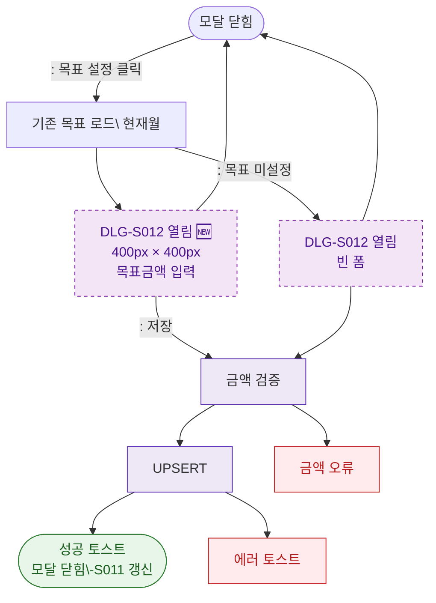

## 1. 목적
DLG-S012 목표매출설정 모달(🆕)의 열기/닫기 생명주기를 표현한다.

## 2. 전제조건
- SCR-S011 매출예측에서 목표 설정 버튼 클릭

## 3. 다이어그램

## 4. 엣지 설명

| 출발 | 도착 | 설명 |
|------|------|------|
| CLOSED | LOAD | 목표 설정 버튼 클릭 |
| LOAD | OPEN | 기존 목표 있음 |
| LOAD | OPEN_EMPTY | 목표 미설정 |
| UPSERT | SUCCESS | 저장 성공 |
