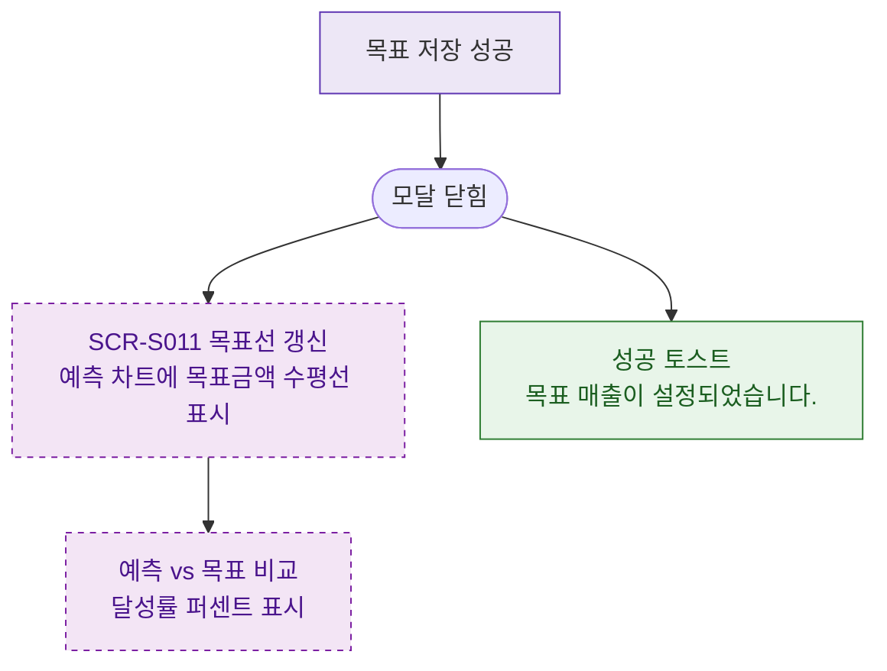

## 1. 목적
DLG-S012 저장 후 SCR-S011 예측 차트 갱신 분기를 표현한다.

## 2. 전제조건
- DLG-S012에서 저장 성공

## 3. 다이어그램

## 4. 엣지 설명

| 출발 | 도착 | 설명 |
|------|------|------|
| SAVE_OK | CLOSED | 저장 → 닫힘 |
| CLOSED | UPDATE_CHART | 차트 목표선 갱신 |
| UPDATE_CHART | COMPARE | 예측 vs 목표 비교 |
