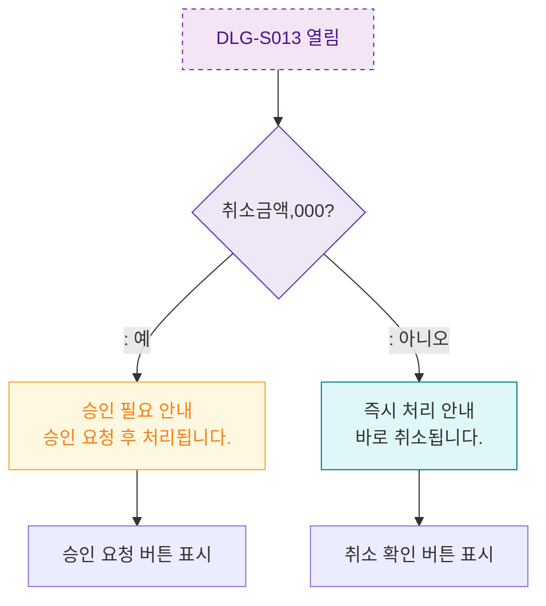

## 1. 목적
DLG-S013은 확인 전용 모달. 취소 전 승인 금액 조건 분기를 표현한다.

## 2. 전제조건
- DLG-S013 열림 상태

## 3. 다이어그램

## 4. 엣지 설명

| 출발 | 도착 | 설명 |
|------|------|------|
| OPEN | AMOUNT_GATE | 금액 조건 확인 |
| AMOUNT_GATE | APPROVAL_INFO | 10만원 이상 → 승인 필요 안내 |
| AMOUNT_GATE | DIRECT_INFO | 10만원 미만 → 즉시 처리 안내 |
