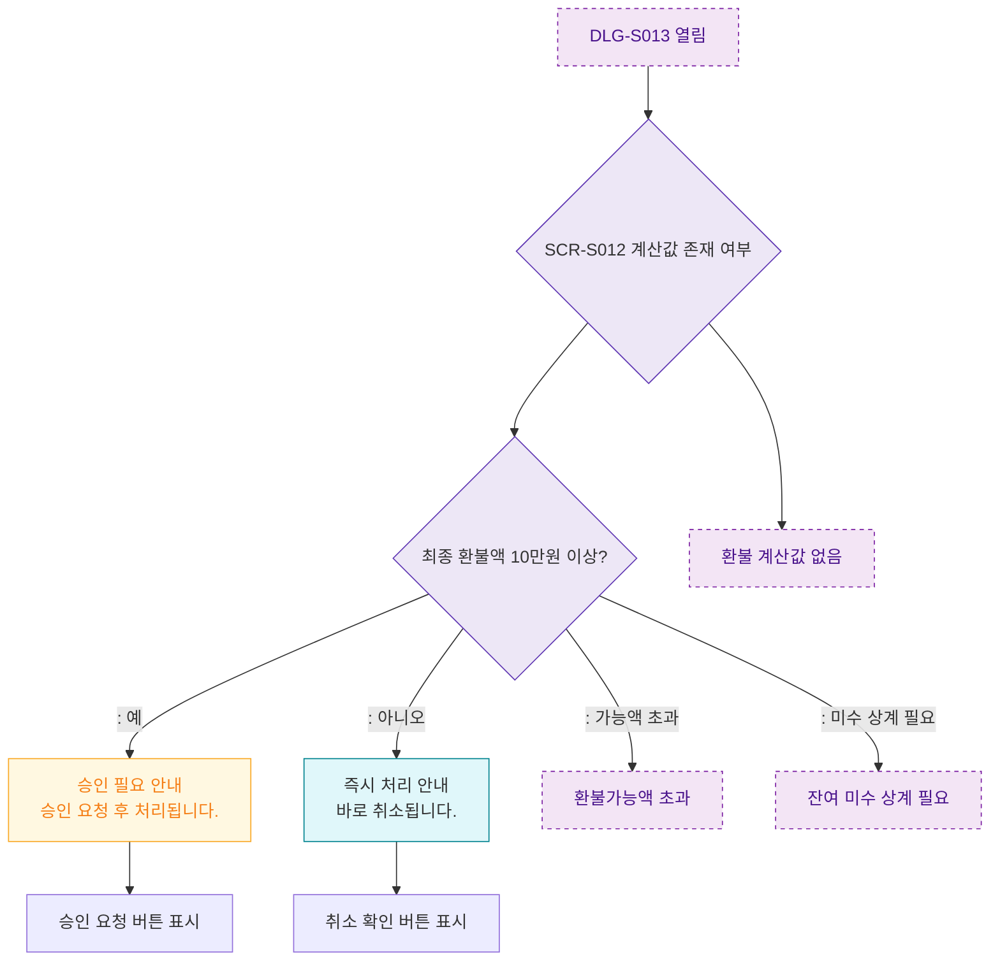

## 1. 목적
DLG-S013은 SCR-S012 환불 계산 박스를 그대로 확인하는 모달이다. 별도 계산식을 정의하지 않고 검증 포인트만 표현한다.

## 2. 전제조건
- DLG-S013 열림 상태

## 3. 다이어그램

```mermaid
flowchart TD
    OPEN[DLG-S013 열림] --> PREVIEW_OK{SCR-S012 계산값 존재 여부}
    PREVIEW_OK --> AMOUNT_GATE{최종 환불액 10만원 이상?}
    PREVIEW_OK --> ERR_PREVIEW[환불 계산값 없음]

    AMOUNT_GATE -->|": 예"|APPROVAL_INFO[승인 필요 안내\n승인 요청 후 처리됩니다.]
    AMOUNT_GATE -->|": 아니오"|DIRECT_INFO[즉시 처리 안내\n바로 취소됩니다.]
    AMOUNT_GATE -->|": 가능액 초과"|ERR_EXCEED[환불가능액 초과]
    AMOUNT_GATE -->|": 미수 상계 필요"|ERR_OFFSET[잔여 미수 상계 필요]

    APPROVAL_INFO --> CONFIRM_BTN[승인 요청 버튼 표시]
    DIRECT_INFO --> CONFIRM_BTN2[취소 확인 버튼 표시]

    classDef newFeature fill:#F3E5F5,stroke:#7B1FA2,color:#4A148C,stroke-dasharray:4 4
    classDef system fill:#EDE7F6,stroke:#5E35B2
    classDef warning fill:#FFF8E1,stroke:#F9A825,color:#F57F17
    classDef info fill:#E0F7FA,stroke:#00838F

    class OPEN newFeature
    class PREVIEW_OK,AMOUNT_GATE system
    class APPROVAL_INFO warning
    class DIRECT_INFO info
    class ERR_PREVIEW,ERR_EXCEED,ERR_OFFSET newFeature
```

## 4. 엣지 설명

| 출발 | 도착 | 설명 |
|------|------|------|
| OPEN | PREVIEW_OK | SCR-S012 계산값 확인 |
| AMOUNT_GATE | APPROVAL_INFO | 10만원 이상 → 승인 필요 안내 |
| AMOUNT_GATE | DIRECT_INFO | 10만원 미만 → 즉시 처리 안내 |
