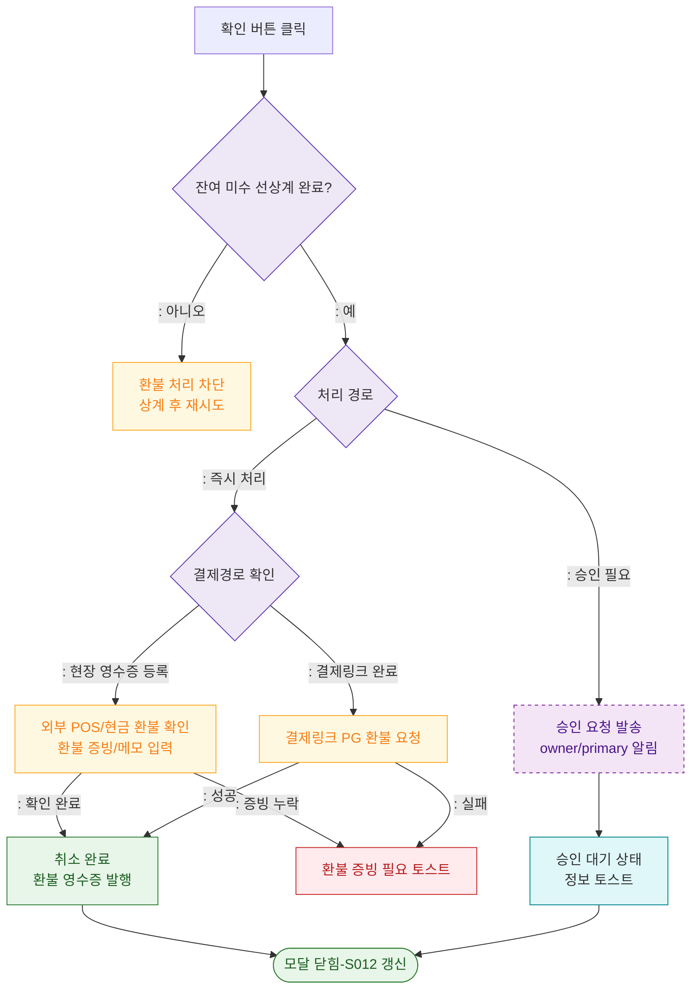

## 1. 목적
DLG-S013 확인 후 `승인 요청` 또는 `즉시 환불 처리` 분기를 표현한다. 계산식은 SCR-S012를 그대로 따른다.

## 2. 전제조건
- DLG-S013에서 확인 버튼 클릭

## 3. 다이어그램

## 4. 엣지 설명

| 출발 | 도착 | 설명 |
|------|------|------|
| CONFIRM | OFFSET_CHECK | 환불 전 미수 상계 여부 확인 |
| ROUTE | REFUND_ROUTE | 즉시 처리 시 결제경로 확인 |
| ROUTE | SEND_APPROVAL | 승인 요청 발송 |
| REFUND_ROUTE | EXTERNAL_REFUND | 현장 영수증 등록 건은 외부 POS/현금 환불 확인 |
| REFUND_ROUTE | LINK_PG_REFUND | 결제링크 완료 건은 PG 환불 요청 |
| EXTERNAL_REFUND | CANCEL_DONE | 외부 환불 확인 후 취소 완료 |
| LINK_PG_REFUND | CANCEL_DONE | 결제링크 PG 환불 성공 |
| SEND_APPROVAL | WAIT_STATE | 승인 대기 상태 |
| OFFSET_CHECK | BLOCK | 잔여 미수 존재 시 환불 차단 |
