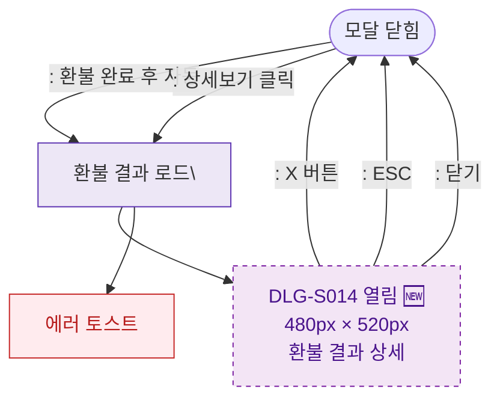

## 1. 목적
DLG-S014 환불상세(결과 조회) 모달(🆕)의 열기/닫기 생명주기를 표현한다. 환불 완료 후 결과 확인용 모달이다.

## 2. 전제조건
- SCR-S012에서 환불 완료된 건의 상세보기 클릭
- 또는 환불 처리 완료 후 자동 표시

## 3. 다이어그램

## 4. 엣지 설명

| 출발 | 도착 | 설명 |
|------|------|------|
| CLOSED | LOAD | 환불 완료 후 자동 표시 |
| CLOSED | LOAD | 상세보기 수동 클릭 |
| LOAD | OPEN | 로드 성공 |
