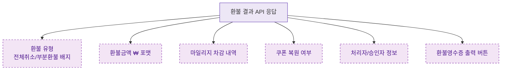

## 1. 목적
DLG-S014는 조회 전용. 환불 결과 데이터 표시 포맷을 표현한다.

## 2. 전제조건
- DLG-S014 열림 상태

## 3. 다이어그램

## 4. 엣지 설명

| 출발 | 도착 | 설명 |
|------|------|------|
| DATA | REFUND_TYPE | 환불 유형 배지 |
| DATA | MILEAGE_INFO | 마일리지 차감 내역 |
| DATA | COUPON_INFO | 쿠폰 복원 여부 |
| DATA | RECEIPT_BTN | 영수증 출력 버튼 |
