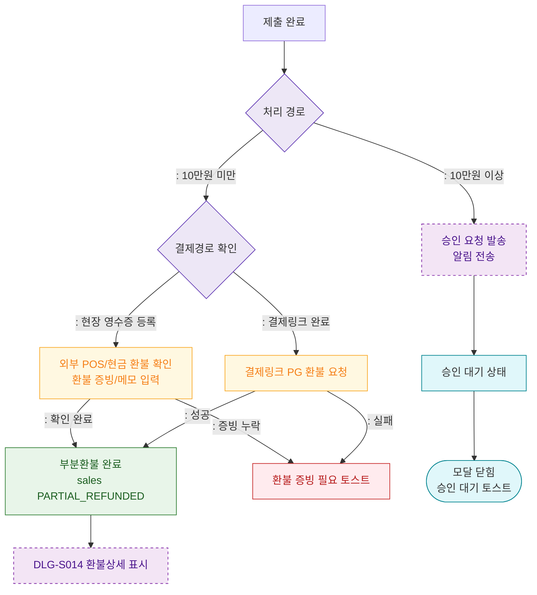

## 1. 목적
DLG-S015 부분환불 처리 후 승인 대기 또는 즉시 완료 분기를 표현한다.

## 2. 전제조건
- DLG-S015에서 제출 완료

## 3. 다이어그램

## 4. 엣지 설명

| 출발 | 도착 | 설명 |
|------|------|------|
| ROUTE | REFUND_ROUTE | 즉시 처리 시 결제경로 확인 |
| ROUTE | SEND_APPROVAL | 승인 요청 발송 |
| REFUND_ROUTE | EXTERNAL_REFUND | 현장 영수증 등록 건은 외부 POS/현금 환불 확인 |
| REFUND_ROUTE | LINK_PG_REFUND | 결제링크 완료 건은 PG 환불 요청 |
| EXTERNAL_REFUND | PARTIAL_DONE | 외부 환불 확인 후 부분환불 완료 |
| LINK_PG_REFUND | PARTIAL_DONE | 결제링크 PG 환불 성공 |
| PARTIAL_DONE | DLG_S014 | 환불 상세 모달 표시 |
