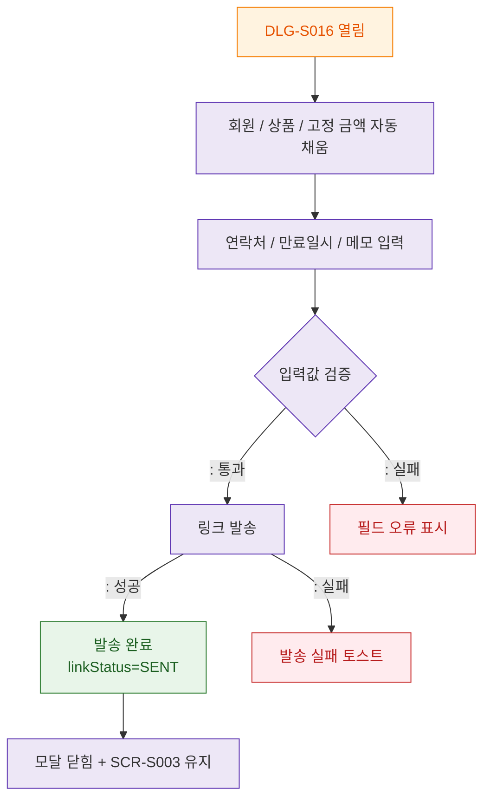

## 1. 목적
DLG-S016의 열림부터 발송 완료까지 생명주기를 표현한다.

## 2. 전제조건
- SCR-S003에서 `결제링크 발송` 버튼 클릭

## 3. 다이어그램

## 4. 엣지 설명

| 출발 | 도착 | 설명 |
|------|------|------|
| OPEN | PREFILL | 원결제 요약 자동 채움 |
| VALIDATE | SEND | 회원 연락처 / 만료일시 검증 통과 |
| SEND | DONE | 링크 발송 성공 |
