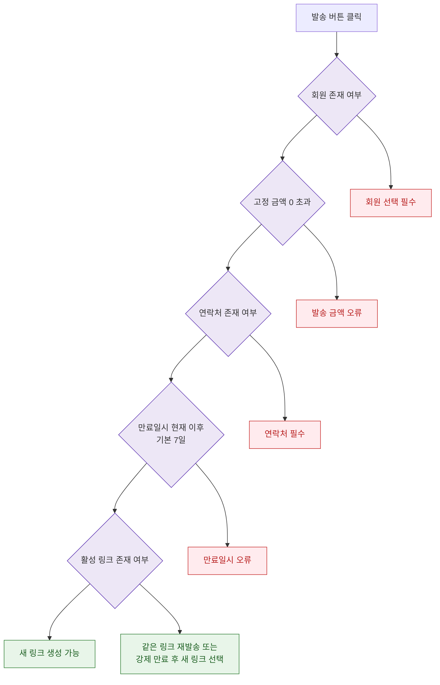

## 1. 목적
DLG-S016의 주요 필드 검증 규칙을 표현한다.

## 2. 전제조건
- DLG-S016 열림 상태

## 3. 다이어그램

## 4. 엣지 설명

| 출발 | 도착 | 설명 |
|------|------|------|
| MEMBER_CHECK | ERR_MEMBER | 회원 없는 링크 발송 불가 |
| CONTACT_CHECK | ERR_CONTACT | 연락처 필수 |
| ACTIVE_CHECK | RESEND_MODE | 활성 링크는 같은 링크 재발송 또는 강제 만료 후 새 링크 생성 선택 |
