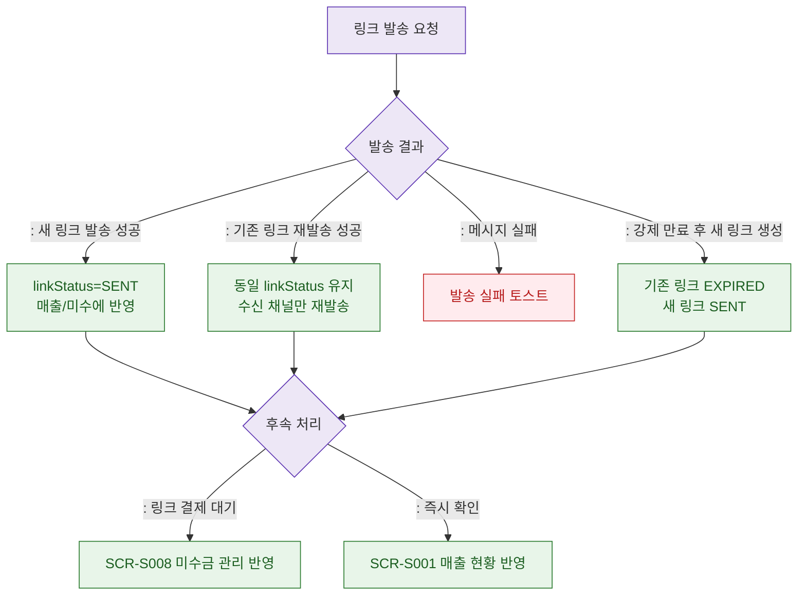

## 1. 목적
DLG-S016 발송 후 결과 분기를 표현한다.

## 2. 전제조건
- DLG-S016에서 발송 버튼 클릭

## 3. 다이어그램

## 4. 엣지 설명

| 출발 | 도착 | 설명 |
|------|------|------|
| RESULT | SENT | 새 링크 발송 성공 |
| RESULT | RESENT | 기존 활성 링크 재발송 |
| RESULT | EXPIRE_AND_NEW | 기존 링크 만료 후 새 링크 발송 |
| FOLLOWUP | UNPAID | 링크 결제 전 미수금 관리 대상 |
