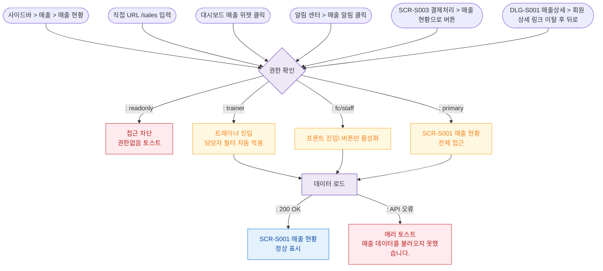

## 1. 목적
SCR-S001 매출 현황 화면으로 진입 가능한 모든 경로를 정의하고, 진입 시 권한 분기를 표현한다.

## 2. 전제조건
- 사용자가 로그인된 상태
- 세션 유효

## 3. 다이어그램

## 4. 엣지 설명

| 출발 | 도착 | 설명 |
|------|------|------|
| 사이드바 | AUTH | 사이드바 매출 메뉴 클릭 |
| URL | AUTH | 직접 /sales URL 진입 |
| 대시보드 위젯 | AUTH | 대시보드 매출 위젯 클릭 |
| 알림 센터 | AUTH | 매출 관련 알림 클릭 |
| SCR-S003 | AUTH | 결제 완료 후 매출 현황으로 이동 |
| AUTH | BLOCKED | readonly 역할 차단 |
| AUTH | TRAINER_FILTER | 트레이너 — 담당자 필터 자동 적용 |
| AUTH | FC_VIEW | 프론트 — POS 버튼만 활성 |
| AUTH | FULL | 관리자급 전체 접근 |
| LOAD | S001 | 데이터 로드 성공 |
| LOAD | ERR | 데이터 로드 실패 |
