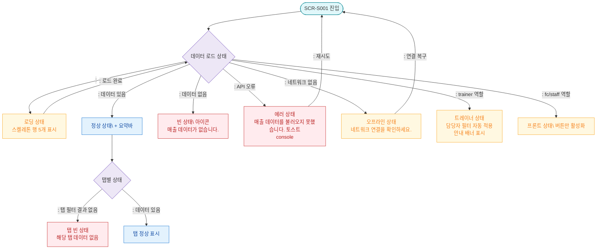

## 1. 목적
SCR-S001의 로딩/빈/에러/권한없음/오프라인 등 모든 UI 상태를 표현한다.

## 2. 전제조건
- SCR-S001 진입 시도

## 3. 다이어그램

## 4. 엣지 설명

| 출발 | 도착 | 설명 |
|------|------|------|
| LOAD_STATE | SKELETON | → 스켈레톤 |
| LOAD_STATE | NORMAL | 정상 데이터 로드 |
| LOAD_STATE | EMPTY | 데이터 0건 |
| LOAD_STATE | ERROR | API 오류 |
| LOAD_STATE | OFFLINE | 네트워크 없음 |
| LOAD_STATE | TRAINER_STATE | 트레이너 자동 필터 |
| LOAD_STATE | FC_STATE | 프론트 제한 |
| ERROR | ENTRY | 재시도 |
| OFFLINE | ENTRY | 연결 복구 후 재시도 |
