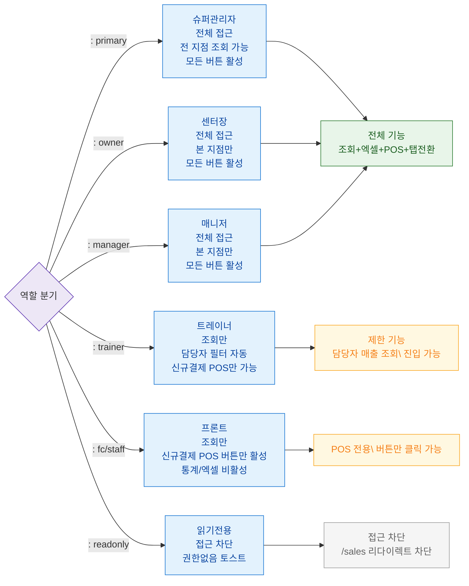

## 1. 목적
SCR-S001에서 6개 역할별 접근 가능 범위와 제한 사항을 표현한다.

## 2. 전제조건
- 로그인 완료

## 3. 다이어그램

## 4. 엣지 설명

| 출발 | 도착 | 설명 |
|------|------|------|
| AUTH | PRIMARY | 슈퍼관리자 분기 |
| AUTH | OWNER | 센터장 분기 |
| AUTH | MANAGER | 매니저 분기 |
| AUTH | TRAINER | 트레이너 분기 — 담당자 자동 필터 |
| AUTH | FC | 프론트 분기 — POS만 활성 |
| AUTH | READONLY | 읽기전용 — 접근 차단 |
