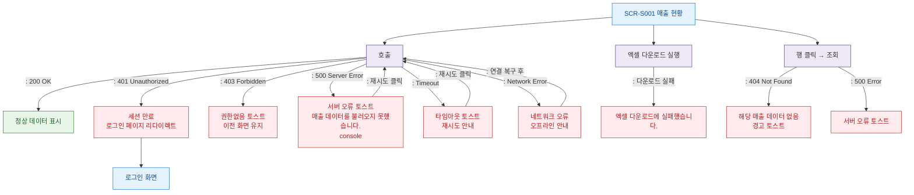

## 1. 목적
SCR-S001에서 발생 가능한 모든 에러/예외 상황과 복구 경로를 표현한다.

## 2. 전제조건
- SCR-S001 진입 시도 또는 운영 중

## 3. 다이어그램

## 4. 엣지 설명

| 출발 | 도착 | 설명 |
|------|------|------|
| API_CALL | ERR_401 | 401 → 세션 만료 처리 |
| API_CALL | ERR_403 | 403 → 권한없음 토스트 |
| API_CALL | ERR_500 | 500 → 서버 오류 토스트 |
| API_CALL | ERR_TIMEOUT | 타임아웃 → 재시도 안내 |
| API_CALL | ERR_NETWORK | 네트워크 오류 → 오프라인 안내 |
| ERR_500 | API_CALL | 재시도 |
| ERR_TIMEOUT | API_CALL | 재시도 |
| EXCEL_CALL | ERR_EXCEL | 엑셀 다운로드 실패 |
| ROW_CLICK | ERR_ROW | 행 데이터 없음 |
