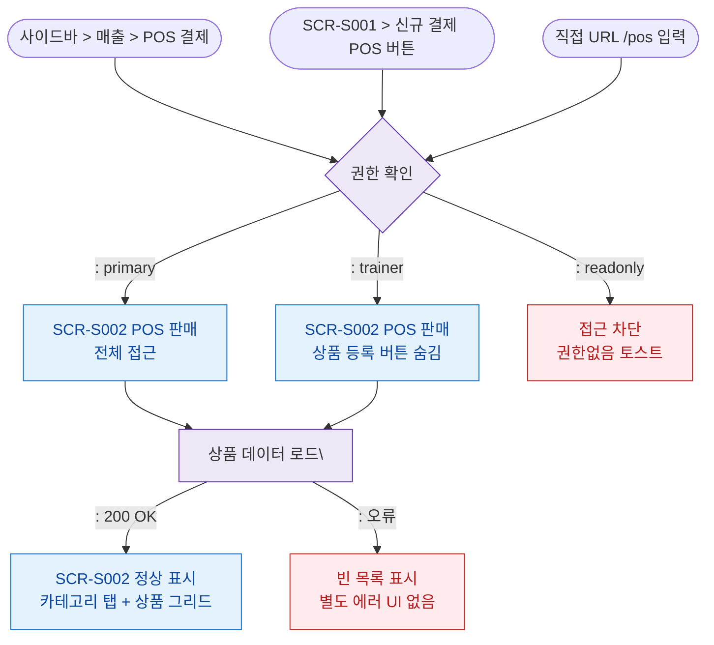

## 1. 목적
SCR-S002 POS 판매 화면의 모든 진입 경로와 권한 분기를 표현한다.

## 2. 전제조건
- 로그인 완료

## 3. 다이어그램

## 4. 엣지 설명

| 출발 | 도착 | 설명 |
|------|------|------|
| 사이드바 | AUTH | 사이드바 POS 결제 클릭 |
| SCR-S001 버튼 | AUTH | 신규 결제 POS 버튼 클릭 |
| AUTH | FULL | 관리자/프론트 전체 접근 |
| AUTH | TRAINER | 트레이너 — 상품 등록 숨김 |
| AUTH | BLOCKED | readonly 차단 |
| LOAD | S002 | 상품 데이터 로드 성공 |
| LOAD | ERR | 로드 실패 → 빈 목록 |
