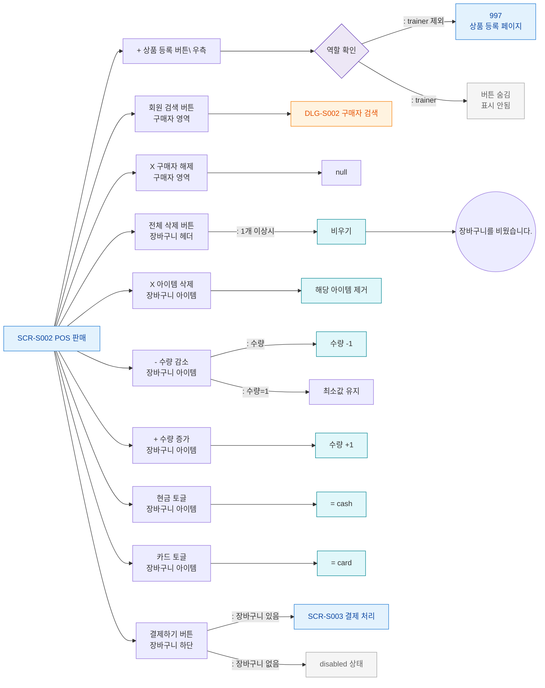

## 1. 목적
SCR-S002의 모든 버튼과 클릭 가능한 요소를 노드화한다.

## 2. 전제조건
- SCR-S002 진입 완료

## 3. 다이어그램

## 4. 엣지 설명

| 출발 | 도착 | 설명 |
|------|------|------|
| REG_AUTH | PAGE_997 | 트레이너 제외 → 상품 등록 이동 |
| REG_AUTH | REG_HIDDEN | 트레이너 → 버튼 숨김 |
| BTN_BUYER | DLG_S002 | 구매자 검색 모달 |
| BTN_CLEAR_ALL | CART_EMPTY | 전체 삭제 |
| BTN_CHECKOUT | SCR_S003 | 결제 처리 이동 |
| BTN_CHECKOUT | DISABLED | 장바구니 비어있음 |
