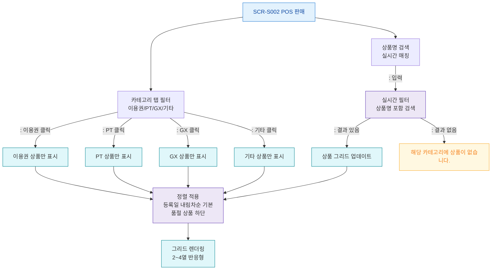

## 1. 목적
SCR-S002의 카테고리 탭 필터, 상품명 검색, 상품 정렬 흐름을 표현한다.

## 2. 전제조건
- SCR-S002 진입 완료, 상품 목록 로드됨

## 3. 다이어그램

## 4. 엣지 설명

| 출발 | 도착 | 설명 |
|------|------|------|
| TAB_FILTER | CAT_MEMBER | 이용권 탭 클릭 |
| SEARCH_BOX | SEARCH_FILTER | 실시간 검색 |
| SEARCH_FILTER | GRID_UPDATE | 검색 결과 표시 |
| SEARCH_FILTER | GRID_EMPTY | 결과 없음 |
