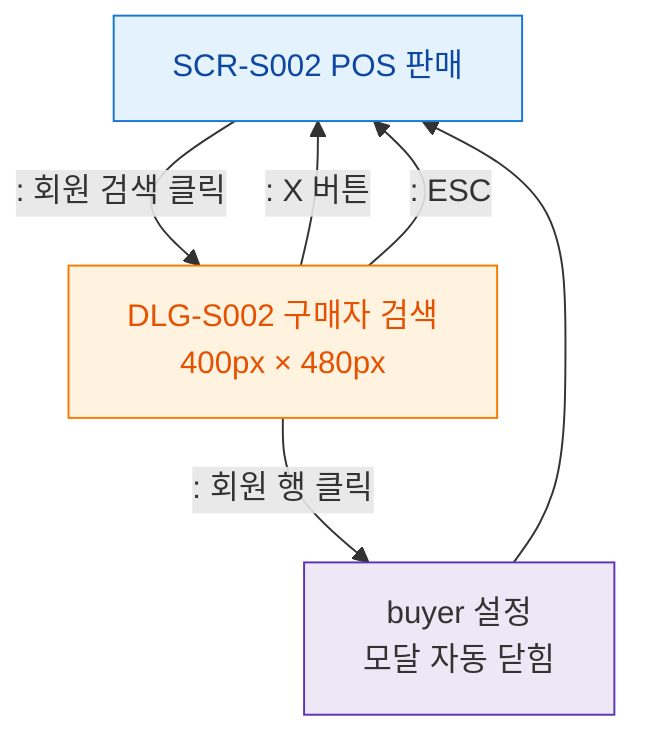

## 1. 목적
SCR-S002에서 발생하는 모달 트리거 경로를 표현한다.

## 2. 전제조건
- SCR-S002 진입 완료

## 3. 다이어그램

## 4. 엣지 설명

| 출발 | 도착 | 설명 |
|------|------|------|
| S002 | DLG_S002 | 회원 검색 버튼 클릭 |
| DLG_S002 | BUYER_SET | 회원 선택 → 자동 닫힘 |
| DLG_S002 | S002 | X 버튼 닫기 |
| DLG_S002 | S002 | ESC 닫기 |
