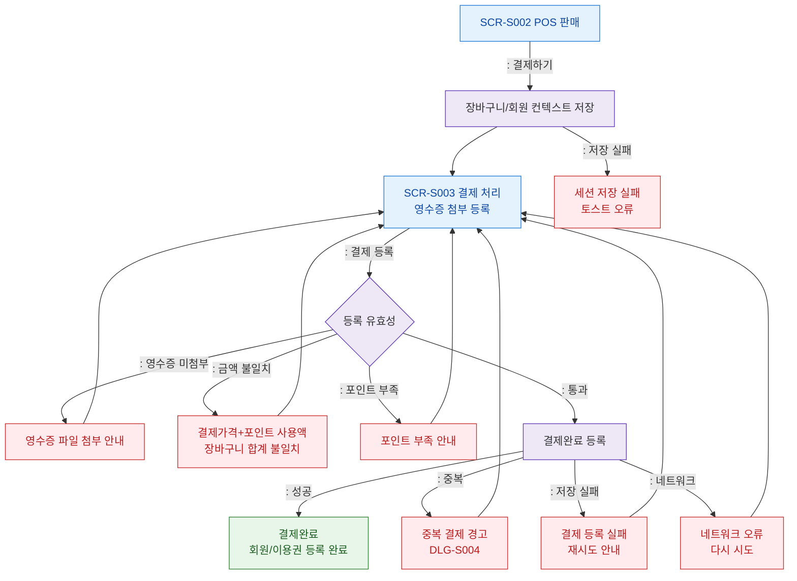

## 1. 목적
SCR-S002 POS 판매에서 발생 가능한 에러/예외와 SCR-S003 영수증 첨부 결제 등록 실패 복구 흐름을 표현한다.

## 2. 전제조건
- SCR-S002에서 결제하기 → SCR-S003 이동

## 3. 다이어그램

## 4. 엣지 설명

| 출발 | 도착 | 설명 |
|------|------|------|
| SESSION_SAVE | SCR_S003 | 장바구니/회원 컨텍스트 저장 후 결제 처리 이동 |
| REGISTER_GATE | ERR_RECEIPT | 영수증 파일 미첨부 |
| REGISTER_GATE | ERR_AMOUNT | 결제가격+포인트 사용액과 장바구니 합계 불일치 |
| REGISTER_GATE | ERR_POINT | 포인트 부족 |
| REGISTER | REGISTER_SUCCESS | 결제완료 + 회원/이용권 등록 완료 |
| REGISTER | ERR_DUP | 중복 결제 경고 |
