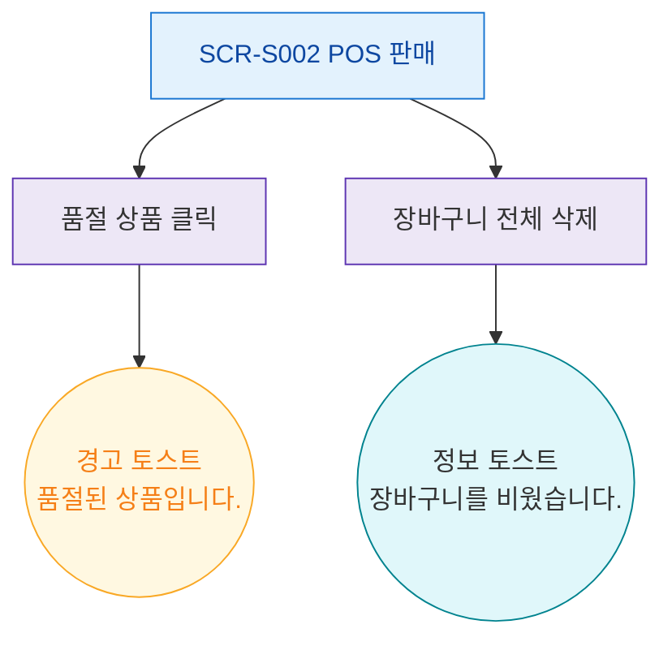

## 1. 목적
SCR-S002에서 발생하는 모든 토스트/피드백 메시지의 발생 조건을 표현한다.

## 2. 전제조건
- SCR-S002 진입 완료

## 3. 다이어그램

## 4. 엣지 설명

| 출발 | 도착 | 토스트 타입 | 메시지 |
|------|------|-------------|--------|
| EVT_SOLDOUT | TOAST_W_SOLD | warning | 품절된 상품입니다. |
| EVT_CLEAR | TOAST_I_CLEAR | info | 장바구니를 비웠습니다. |
