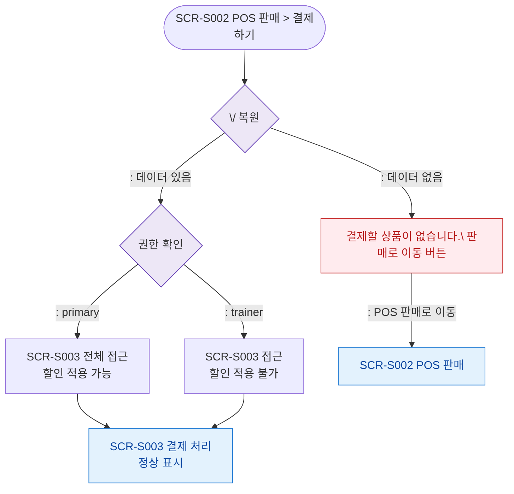

## 1. 목적
SCR-S003 결제 처리 화면의 진입 경로와 데이터 복원 분기를 표현한다.

## 2. 전제조건
- SCR-S002에서 결제하기 버튼 클릭 후 이동

## 3. 다이어그램

## 4. 엣지 설명

| 출발 | 도착 | 설명 |
|------|------|------|
| SESSION_RESTORE | AUTH | 세션 데이터 있음 → 권한 확인 |
| SESSION_RESTORE | ERR_NO_CART | 세션 없음 → 오류 안내 |
| AUTH | TRAINER | 트레이너 — 할인 적용 불가 |
