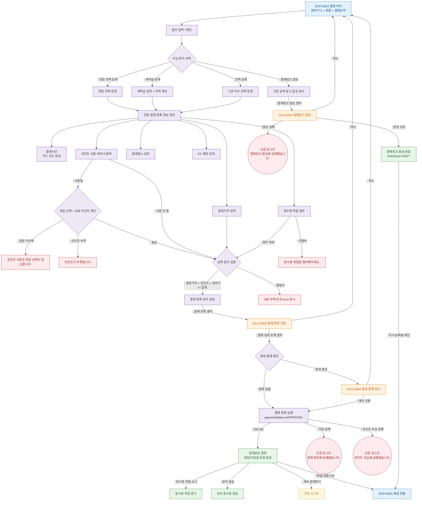

## 1. 목적
결제 처리를 `할인 적용 → 수납 방식 선택 → 현장 영수증 첨부 등록 또는 결제링크 발송 → 결제완료 + 회원/이용권 등록 완료` 기준으로 표현한다.

## 2. 전제조건
- SCR-S003 진입 완료, 장바구니 데이터 복원됨

## 3. 다이어그램

## 4. 엣지 설명

| 출발 | 도착 | 설명 |
|------|------|------|
| COLLECTION | LINK_READY | 링크 발송은 별도 비대면 수납 경로 |
| FIELD_INPUT | RECEIPT | 현장 결제 등록은 영수증 첨부 필수 |
| POINT_MEMBER | ERR_NO_MEMBER | 포인트 사용 시 회원 선택 필수 |
| POINT_MEMBER | ERR_POINT | 포인트 잔액 부족 |
| AMOUNT_CHECK | READY | 결제가격 + 포인트 사용액이 장바구니 합계와 일치 |
| AMOUNT_CHECK | ERR_AMOUNT | 결제 총액 불일치 |
| DUP_CHECK | DLG-S004 | 중복 결제 경고 모달 |
| REGISTER | COMPLETE | 결제완료 + 회원/이용권 등록 완료 |
| DLG-S016 | LINK_SENT | 고정 금액 링크 발송 성공 |
