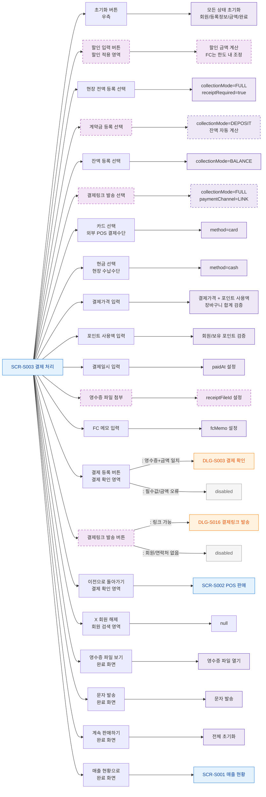

## 1. 목적
SCR-S003의 현장 영수증 첨부 등록과 결제링크 발송 관련 버튼/클릭 요소를 노드화한다.

## 2. 전제조건
- SCR-S003 진입 완료

## 3. 다이어그램

## 4. 엣지 설명

| 출발 | 도착 | 설명 |
|------|------|------|
| BTN_MODE_DEPOSIT | MODE_DEPOSIT | 계약금 등록 모드 진입 |
| BTN_MODE_LINK | MODE_LINK | 비대면 링크 결제 경로 선택 |
| BTN_RECEIPT_UPLOAD | RECEIPT_SET | 현장 등록 필수 영수증 첨부 |
| INPUT_PRICE | AMOUNT_CHECK | 결제가격+포인트 사용액=장바구니 합계 검증 |
| INPUT_POINT | POINT_CHECK | 포인트 사용 시 회원/잔액 검증 |
| BTN_CONFIRM | DLG_S003 | 영수증 첨부 및 금액 일치 통과 → 결제 확인 모달 |
| BTN_LINK_SEND | DLG_S016 | 링크 발송 모달 |
| BTN_CONFIRM | DISABLED | 유효성 실패 → disabled |
| BTN_BACK | SCR_S002 | 이전 POS 화면으로 |
| BTN_TO_SALES | SCR_S001 | 매출 현황으로 |
