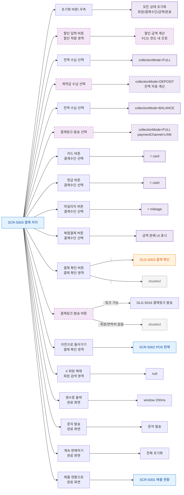

## 1. 목적
SCR-S003의 모든 버튼과 클릭 가능한 요소를 노드화한다.

## 2. 전제조건
- SCR-S003 진입 완료

## 3. 다이어그램

## 4. 엣지 설명

| 출발 | 도착 | 설명 |
|------|------|------|
| BTN_MODE_DEPOSIT | MODE_DEPOSIT | 계약금 수납 모드 진입 |
| BTN_MODE_LINK | MODE_LINK | 링크 결제 경로 선택 |
| BTN_CONFIRM | DLG_S003 | 즉시 수납 유효성 통과 → 결제 확인 모달 |
| BTN_LINK_SEND | DLG_S016 | 링크 발송 모달 |
| BTN_CONFIRM | DISABLED | 유효성 실패 → disabled |
| BTN_BACK | SCR_S002 | 이전 POS 화면으로 |
| BTN_TO_SALES | SCR_S001 | 매출 현황으로 |
