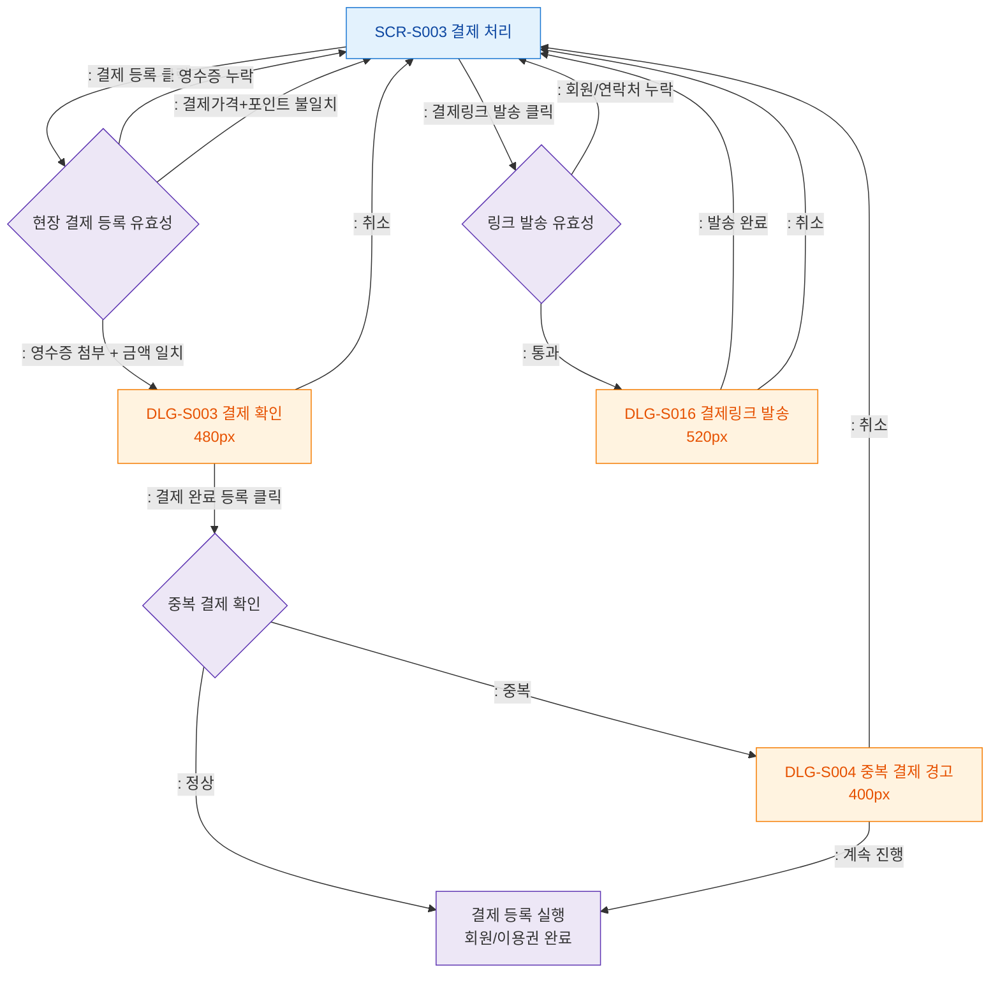

## 1. 목적
SCR-S003에서 발생하는 결제 확인, 중복 결제 경고, 결제링크 발송 모달 트리거를 표현한다.

## 2. 전제조건
- SCR-S003 진입 완료

## 3. 다이어그램

## 4. 엣지 설명

| 출발 | 도착 | 설명 |
|------|------|------|
| S003 | CONFIRM_GATE | 현장 결제 등록 버튼 |
| CONFIRM_GATE | DLG_S003 | 영수증 첨부, 금액 일치, 필수값 통과 |
| S003 | LINK_GATE | 결제링크 발송 버튼 |
| LINK_GATE | DLG_S016 | 회원/연락처 확인 후 링크 발송 모달 |
| DUP_CHECK | DLG_S004 | 중복 결제 감지 → 경고 모달 |
| DLG_S004 | REGISTER | 중복 무시하고 등록 |
