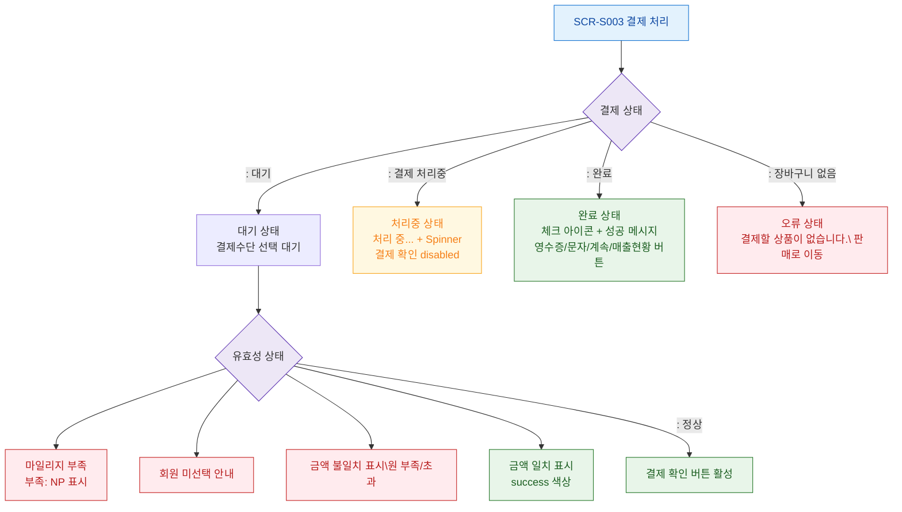

## 1. 목적
SCR-S003의 모든 UI 상태(로딩/완료/에러/마일리지부족 등)를 표현한다.

## 2. 전제조건
- SCR-S003 진입 완료

## 3. 다이어그램

## 4. 엣지 설명

| 출발 | 도착 | 설명 |
|------|------|------|
| PAY_STATE | PROCESSING | 결제 처리 중 |
| PAY_STATE | COMPLETE | 결제 완료 |
| PAY_STATE | NO_CART | 장바구니 없음 |
| VALID_STATE | ERR_MILEAGE | 마일리지 부족 |
| VALID_STATE | ERR_MIXED | 복합결제 불일치 |
