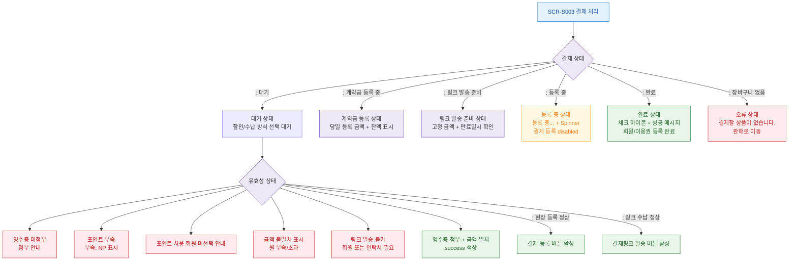

## 1. 목적
SCR-S003의 주요 UI 상태를 `현장 영수증 첨부 등록`, `계약금`, `결제링크 발송 준비`까지 포함해 표현한다.

## 2. 전제조건
- SCR-S003 진입 완료

## 3. 다이어그램

```mermaid
flowchart TD
    S003[SCR-S003 결제 처리] --> PAY_STATE{결제 상태}

    PAY_STATE -->|": 대기"|IDLE[대기 상태\n할인/수납 방식 선택 대기]
    PAY_STATE -->|": 계약금 등록 중"|DEPOSIT_STATE[계약금 등록 상태\n당일 등록 금액 + 잔액 표시]
    PAY_STATE -->|": 링크 발송 준비"|LINK_STATE[링크 발송 준비 상태\n고정 금액 + 만료일시 확인]
    PAY_STATE -->|": 등록 중"|PROCESSING[등록 중 상태\n등록 중... + Spinner\n결제 등록 disabled]
    PAY_STATE -->|": 완료"|COMPLETE[완료 상태\n체크 아이콘 + 성공 메시지\n회원/이용권 등록 완료]
    PAY_STATE -->|": 장바구니 없음"|NO_CART[오류 상태\n결제할 상품이 없습니다.<br/> 판매로 이동]

    IDLE --> VALID_STATE{유효성 상태}
    VALID_STATE --> ERR_RECEIPT[영수증 미첨부\n첨부 안내]
    VALID_STATE --> ERR_POINT[포인트 부족\n부족: NP 표시]
    VALID_STATE --> ERR_MEMBER[포인트 사용 회원 미선택 안내]
    VALID_STATE --> ERR_AMOUNT[금액 불일치 표시\n원 부족/초과]
    VALID_STATE --> LINK_INVALID[링크 발송 불가\n회원 또는 연락처 필요]
    VALID_STATE --> VALID_OK[영수증 첨부 + 금액 일치\nsuccess 색상]
    VALID_STATE -->|": 현장 등록 정상"|CONFIRM_ACTIVE[결제 등록 버튼 활성]
    VALID_STATE -->|": 링크 수납 정상"|LINK_ACTIVE[결제링크 발송 버튼 활성]

    classDef screen fill:#E3F2FD,stroke:#1976D2,color:#0D47A1
    classDef error fill:#FFEBEE,stroke:#C62828,color:#B71C1C
    classDef success fill:#E8F5E9,stroke:#2E7D32,color:#1B5E20
    classDef warning fill:#FFF8E1,stroke:#F9A825,color:#F57F17
    classDef system fill:#EDE7F6,stroke:#5E35B2

    class S003 screen
    class ERR_RECEIPT,ERR_POINT,ERR_MEMBER,ERR_AMOUNT,NO_CART,LINK_INVALID error
    class COMPLETE,VALID_OK,CONFIRM_ACTIVE,LINK_ACTIVE success
    class PROCESSING warning
    class PAY_STATE,VALID_STATE,DEPOSIT_STATE,LINK_STATE system
```

## 4. 엣지 설명

| 출발 | 도착 | 설명 |
|------|------|------|
| PAY_STATE | PROCESSING | 결제 등록 중 |
| PAY_STATE | DEPOSIT_STATE | 계약금 입력 후 잔액 표시 |
| PAY_STATE | LINK_STATE | 결제링크 발송 준비 상태 |
| PAY_STATE | COMPLETE | 결제완료 + 회원/이용권 등록 완료 |
| PAY_STATE | NO_CART | 장바구니 없음 |
| VALID_STATE | ERR_RECEIPT | 영수증 파일 미첨부 |
| VALID_STATE | ERR_POINT | 포인트 부족 |
| VALID_STATE | ERR_AMOUNT | 결제 총액 불일치 |
