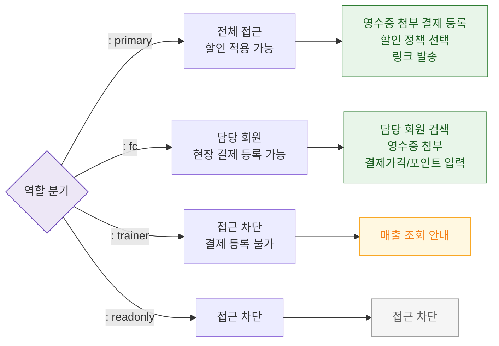

## 1. 목적
SCR-S003에서 역할별 접근 제한을 표현한다.

## 2. 전제조건
- 로그인 완료

## 3. 다이어그램

## 4. 엣지 설명

| 출발 | 도착 | 설명 |
|------|------|------|
| AUTH | FC | FC — 담당 회원 현장 결제 등록 |
| AUTH | TRAINER | 트레이너 — 결제 처리 접근 차단 |
| AUTH | BLOCKED | 접근 차단 |
