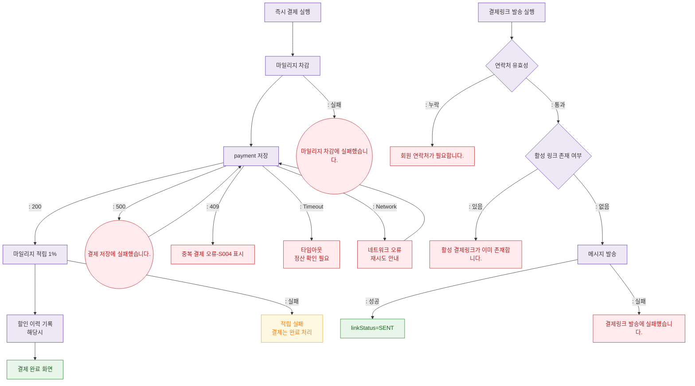

## 1. 목적
SCR-S003의 즉시 결제/결제링크 발송 시 오류 분기를 표현한다.

## 2. 전제조건
- DLG-S003에서 결제 완료 클릭

## 3. 다이어그램

## 4. 엣지 설명

| 출발 | 도착 | 설명 |
|------|------|------|
| STEP1 | ERR_DEDUCT | 마일리지 차감 실패 |
| STEP2 | ERR_INSERT | 오류 |
| STEP2 | ERR_DUP | 409 중복 결제 |
| STEP2 | ERR_TIMEOUT | 타임아웃 |
| STEP3 | ERR_ACCRUE | 적립 실패(결제는 완료) |
| LINK_CONTACT | ERR_CONTACT | 링크 발송 연락처 누락 |
| LINK_ACTIVE_CHECK | ERR_LINK_DUP | 기존 활성 링크 존재 |
