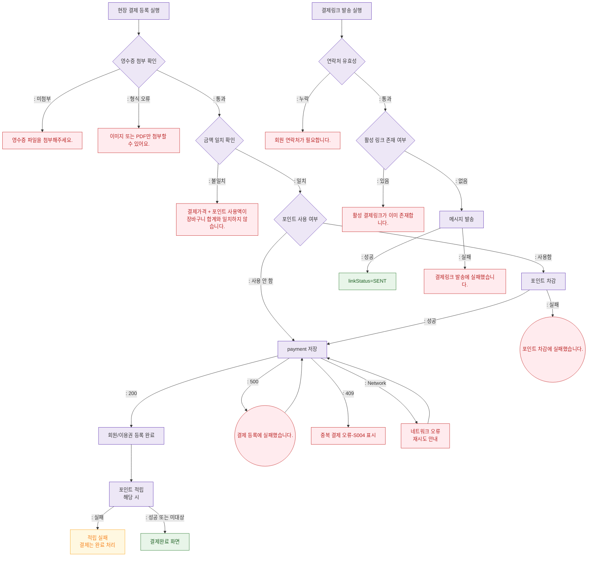

## 1. 목적
SCR-S003의 현장 영수증 첨부 결제 등록과 결제링크 발송 시 오류 분기를 표현한다.

## 2. 전제조건
- DLG-S003에서 결제 완료 등록 클릭

## 3. 다이어그램

## 4. 엣지 설명

| 출발 | 도착 | 설명 |
|------|------|------|
| RECEIPT_CHECK | ERR_RECEIPT | 영수증 파일 미첨부 |
| RECEIPT_CHECK | ERR_RECEIPT_TYPE | 지원하지 않는 파일 형식 |
| AMOUNT_CHECK | ERR_AMOUNT | 결제 총액 불일치 |
| POINT_DEDUCT | ERR_DEDUCT | 포인트 차감 실패 |
| SAVE_PAYMENT | ERR_INSERT | 결제 등록 저장 실패 |
| SAVE_PAYMENT | ERR_DUP | 409 중복 결제 |
| ISSUE_PASS | COMPLETE | 결제완료 + 회원/이용권 등록 완료 |
| LINK_CONTACT | ERR_CONTACT | 링크 발송 연락처 누락 |
| LINK_ACTIVE_CHECK | ERR_LINK_DUP | 기존 활성 링크 존재 |
