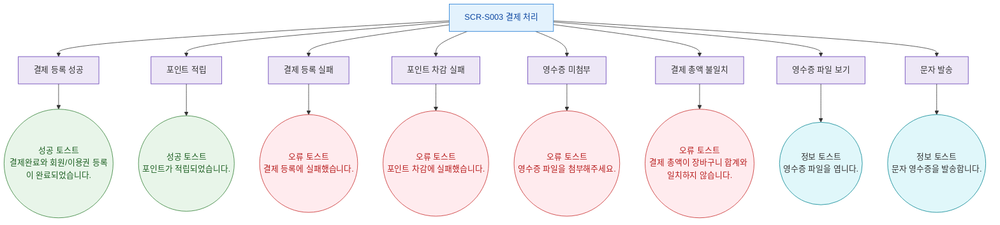

## 1. 목적
SCR-S003에서 발생하는 모든 토스트/피드백 메시지 발생 조건을 표현한다.

## 2. 전제조건
- SCR-S003 진입 완료

## 3. 다이어그램

## 4. 엣지 설명

| 토스트 타입 | 메시지 |
|-------------|--------|
| success | 결제완료와 회원/이용권 등록이 완료되었습니다. |
| success | NP 포인트가 적립되었습니다. |
| error | 결제 등록에 실패했습니다. |
| error | 포인트 차감에 실패했습니다. |
| error | 영수증 파일을 첨부해주세요. |
| error | 결제 총액이 장바구니 합계와 일치하지 않습니다. |
| info | 영수증 파일을 엽니다. |
| info | 문자 영수증을 발송합니다. |
