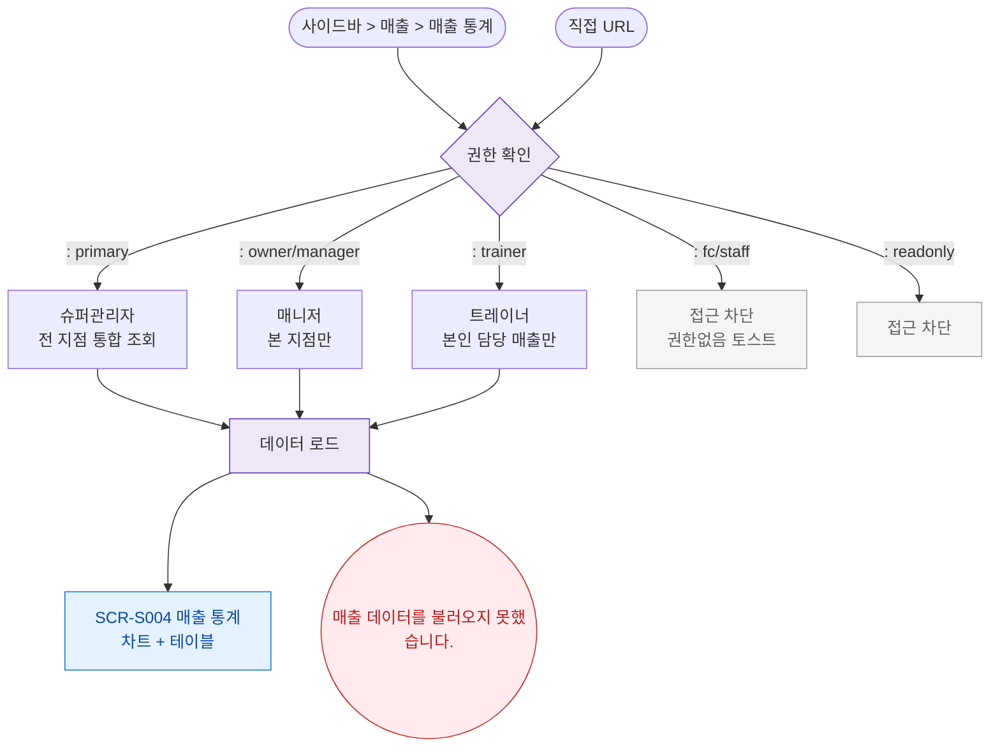

## 1. 목적
SCR-S004 매출 통계 화면의 진입 경로와 권한 분기를 표현한다.

## 2. 전제조건
- 로그인 완료

## 3. 다이어그램

```mermaid
flowchart TD
    SB([사이드바 > 매출 > 매출 통계]) --> AUTH
    URL([직접 URL]) --> AUTH

    AUTH{권한 확인}
    AUTH -->|": primary"|PRIMARY[슈퍼관리자\n전 지점 통합 조회]
    AUTH -->|": owner/manager"|MANAGER[매니저\n본 지점만]
    AUTH -->|": trainer"|TRAINER[트레이너\n본인 담당 매출만]
    AUTH -->|": fc/staff"|FC_BLOCK[접근 차단\n권한없음 토스트]
    AUTH -->|": readonly"|BLOCKED[접근 차단]

    PRIMARY --> LOAD[데이터 로드]
    MANAGER --> LOAD
    TRAINER --> LOAD

    LOAD --> S004[SCR-S004 매출 통계\n차트 + 테이블]
    LOAD --> ERR((매출 데이터를 불러오지 못했습니다.))

    classDef screen fill:#E3F2FD,stroke:#1976D2,color:#0D47A1
    classDef error fill:#FFEBEE,stroke:#C62828,color:#B71C1C
    classDef system fill:#EDE7F6,stroke:#5E35B2
    classDef rbacBlocked fill:#F5F5F5,stroke:#9E9E9E,color:#616161

    class S004 screen
    class ERR error
    class AUTH,LOAD system
    class FC_BLOCK,BLOCKED rbacBlocked
```

## 4. 엣지 설명

| 출발 | 도착 | 설명 |
|------|------|------|
| AUTH | FC_BLOCK | 프론트 접근 차단 |
| LOAD | ERR | API 오류 |
